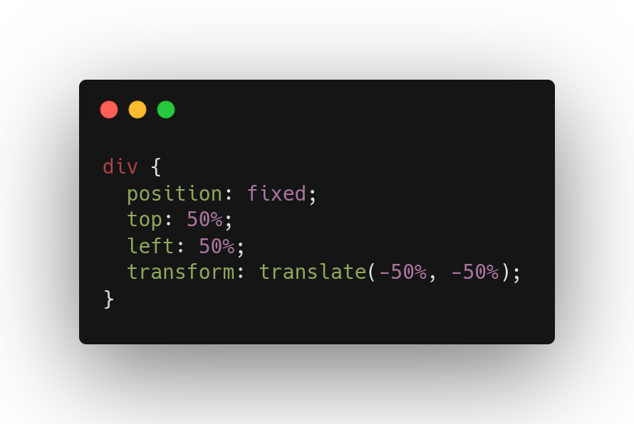

# Centering in CSS

HTML, CSS ကိုစလေ့လာခါစ အားလုံးကြုံနေကျ အခက်ခဲတစ်ခုကတော့ တစ်ခုခုကိုအလယ်ပို့ချင်တဲ့အခါ ကြုံရတဲ့အခက်ခဲပဲဖြစ်ပါတယ်။ Google ခေါက်လိုက်ရင်လည်း solution မျိုးစုံကျလာပေမယ့်ကိုယ့်ပြဿနာနဲ့မကိုက်တာမျိုးတွေလည်းကြုံနိုင်ပါတယ်။ ဒါကြောင့် ဒီ article မှာ ဘယ်လိုနေရာမှာ ဘယ်လိုအလယ်ပို့ကြမလဲကို ပြောပြပေးသွားပါမယ်။

ပထမတစ်ခုကတော့ အသုံးမှားတာများတဲ့ `text-align: center{:css}` ပါ။ သူက element ကို အလယ်ပို့တာမဟုတ်ဘဲ စာကိုပဲ justify-center လုပ်လိုက်တာပါ။ Word မှာ justify center လုပ်သလိုပါပဲ။ စာကတိုရင်တော့အလယ်ပို့လိုက်သလိုဖြစ်သွားပေမယ့် စာရှည်ရင်တော့ တကယ်အလယ်ပို့တာမဟုတ်ဘူးဆိုတာ အထင်ရှားတွေ့ရမှာပါ။ text-align ကလည်း အဲ့လိုပါပဲ width အပြည့်မရှိတဲ့ inline element တချို့ကို နေရာရွှေ့ပေးနိုင်ပါတယ်။ ဒါကြောင့် သုံးတိုင်းအလုပ်မလုပ်တာတွေ့ရမှာပါ။ inline element တွေပဲပါတဲ့ container မှာဆိုရင်တော့ text-align ကိုသုံးပြီး horizontal align  လုပ်လို့ရပါတယ်။ 

နောက်တစ်ခုကတော့ width တစ်ခုရှိတဲ့ inline မဟုတ်တဲ့ element တွေကို horizontal align လုပ်တဲ့နေရာမှာအသုံးများပါတယ်။ margin: 0 auto; ဆိုပြီးပေးလိုက်ရင် horizontally center ဖြစ်သွားမှာပါ။ margin top / bottom ကိုမထိချင်ရင် margin-left: auto; margin-right: auto; ဆိုပြီးပေးလို့ရပါတယ်။ ဒါကို page container တွေမှာအသုံးများတာတွေ့ရပါတယ်။ 

```css /auto/
div {
  max-width: 1200px;
  margin-left: auto;
  margin-right: auto;
}
```


နောက်တစ်ခုက position: absolute/fixed လိုကောင်မျိုးတွေကို အလယ်ပို့တဲ့နေရာမှာအသုံးများပါတယ်။ ဥပမာ loading icon ကို page ရဲ့အလယ်မှာ fixed လုပ်ပြီးပြချင်တာမျိုးတွေမှာသုံးကြပါတယ်။ top: 50%; left: 50%; transform: translate(-50%, -50%);


```js {2,4} showLineNumbers
const h = 'Hello';
const world = 'World';
console.log(h, world);
const a = () => console.log('hello world!');
```


နောက်တစ်ခုကတော့ grid သုံးပြီး အလယ်ပို့တာပါ။ parent container ကို display:grid; place-items: center; ပေးလိုက်ရင် သူ့ထဲမှာရှိတဲ့ child element က container ရဲ့အလယ်ကိုရောက်သွားမှာပါ။ သူကတော့ horizontal ရော vertical ရော align လုပ်ပေးပါတယ်။ သူနဲ့ပုံစံတူတာတစ်ခုက flex သုံးပြီးလုပ်တာပါ။ flex နဲ့ဆိုရင်တော့ horizontal / vertical ထိန်းချုပ်လို့ရသွားပါတယ်။ gird လိုပဲ parent container ကို display: flex; ပေးပြီး align-items: center; လုပ်ရင် vertical align ဖြစ်ပြီး justify-content: center; လုပ်ရင်တော့ horizontal align ဖြစ်ပါတယ် ။ နှစ်ခုလုံးတွဲသုံးလည်းရပါတယ်။ flex မှာက direction: row default  ကို column ထားလိုက်ရင် ပြောင်းပြန်သဘောမျိုး အလုပ်လုပ်မှာဖြစ်ပါတယ်။ ဒီနှစ်ခုလုံးက သုံရတာလည်းလွယ်ပြီးလူသုံးများပါတယ်။


## Position

နောက်တစ်ခုက position: absolute/fixed လိုကောင်မျိုးတွေကို အလယ်ပို့တဲ့နေရာမှာအသုံးများပါတယ်။ ဥပမာ loading icon ကို page ရဲ့အလယ်မှာ fixed လုပ်ပြီးပြချင်တာမျိုးတွေမှာသုံးကြပါတယ်။ `top: 50%; left: 50%; transform: translate(-50%, -50%) {:css}` လို့ပေးလိုက်ရင်အလယ်ရောက်သွားမှာပါ။ သူက parent container ကိုပေးရတာမဟုတ်ဘဲ အလယ်ပို့ချင်တဲ့ element ကိုပဲပေးရတာပါ။ top နဲ့ left ကို 50% ပေးတဲ့အချိန်မှာ element က အလယ်ကိုကျော်နေတာတွေ့ရပါမယ်။ element ရဲ့ အလယ်ကိုမဟုတ်ဘဲ inline/block start point ကို  viewport ရဲ့ 50% မှာထားလိုက်တဲ့အတွက် အဲ့လိုဖြစ်နေရတာဖြစ်ပါတယ်။ ဒါကြောင့် translate(-50%, -50%)  က element size ရဲ့ တစ်ဝက်ကို အနောက်ဆုတ်ပေးလိုက်တဲ့အတွက် အလယ်ရောက်သလိုဖြစ်သွားတာပါ။ 



ဒါကတော့အသုံးများတဲ့ အလယ်ပို့နည်းတွေကို အသုံးပြုတတ်တဲ့နေရာအချို့နဲ့ တွဲပြီးစုထားပေးတာဖြစ်ပါတယ်။ padding ကိုအသုံးပြုပြီး အလယ်ပို့တာမျိုးတွေလည်းရှိပါတယ် ဒါမျိုးတော့အသုံးနည်းပြီး သုံးရတာအဆင်မပြေတာကြောင့် မထည့်ထားပါဘူး။ ဒီလောက်ဆို နေရာအားလုံးနီးပါးမှာ သင့်တော်တဲ့ နည်းကိုသုံးပြီး center လုပ်နိုင်ကြလိမ့်မယ်လို့မျှော်လင့်ပါတယ်။ 

Learn more detail 

[https://www.freecodecamp.org/news/how-to-center-anything-with-css-align-a-div-text-and-more/](https://www.freecodecamp.org/news/how-to-center-anything-with-css-align-a-div-text-and-more/)
